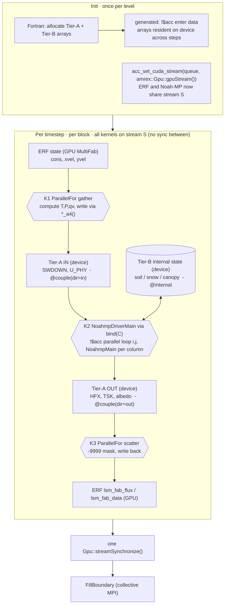
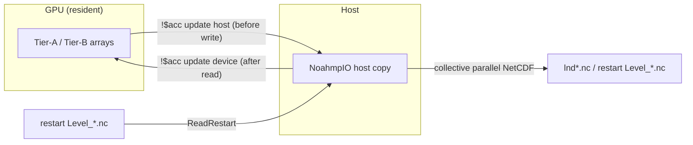

# Plan: GPU-enable Noah-MP under the ERF driver via macro-driven Fortran offload

> Status: **proposal / roadmap** (not yet started) · Audience: contributors
> planning the GPU effort. · Prereqs read: [`spec-overview.md`](spec-overview.md),
> [`spec-fc-api.md`](spec-fc-api.md), [`spec-memory-safety.md`](spec-memory-safety.md).
> Worked example: [`sketch-couple-variable-gpu.md`](sketch-couple-variable-gpu.md).
>
> Filename kept (`plan-cpp-interface.md`) for link stability; the approach is
> **Fortran GPU offload driven by the `@NoahmpMacro` generator**, not a C++ rewrite
> of the physics. See §0.

## 0. TL;DR

The **boundary** is already C++ (`NoahmpIO_type`, `NoahmpArray`,
`NoahmpIO_fatal`), and it **stays** that way: `drivers/erf` remains the C++ host
ERF calls. The **physics in `src/` stays Fortran** — it is *scalar, per-column*
math, and we do **not** rewrite it in C++. To run it on the GPU, the per-column
solver (`NoahmpMain` / `NoahmpMainGlacier`) and the `i,j` driver loop
(`NoahmpDriverMainMod.F90`) are compiled as **GPU device code using a Fortran
offload model** — OpenACC as the primary, OpenMP target as the portability hedge.

Two design decisions shape everything below and are what makes this plan
different from a generic "annotate the physics" port:

1. **The `@NoahmpMacro` generator owns the GPU glue too.** The single contract
   block that today generates the ABI is extended to *also* generate, from the
   same one line per variable: device-residency directives (`!$acc enter data`),
   the ERF-facing device accessor for coupling variables, and the device-pointer
   export/import shims. We do **not** hand-write per-variable device plumbing —
   that would reintroduce exactly the drift the generator exists to prevent. See
   [`spec-fc-api.md`](spec-fc-api.md) §4 and the worked example in
   [`sketch-couple-variable-gpu.md`](sketch-couple-variable-gpu.md).

2. **One shared CUDA stream removes the per-step host sync.** Today
   `ERF_NOAHMP_Advance.cpp` bounces every coupling field host↔device through a pinned
   buffer and calls `Gpu::streamSynchronize()` each step *because Noah-MP runs on
   the host*. Once the physics is offloaded and the coupling arrays are
   device-resident, binding Noah-MP's OpenACC queue to `amrex::Gpu::gpuStream()`
   makes ERF's kernels and Noah-MP's kernels execute in order on **one** stream —
   the host barrier, the pinned staging buffers, and the layout-transpose copies
   all disappear.

The end state: `NoahmpIO_type::DriverMain()` → `bind(C)` → a Fortran
`NoahmpDriverMain` whose `i,j` loop is an `!$acc parallel loop` over the block's
box, calling a device-compiled `NoahmpMain` per land cell, reading/writing
generator-emitted device-resident arrays, on the same stream ERF uses. The
unmodified-offload (host) Fortran build stays the reference oracle.

> **Deliberate trade-off (read this):** Fortran offload is **NVHPC/NVIDIA-first**.
> AMD (OpenMP target via the AMD/Cray Fortran compilers) is possible but less
> mature; Intel GPUs (SYCL) have **no** Fortran offload path. The single-shared-
> stream trick specifically relies on `acc_set_cuda_stream` against
> `amrex::Gpu::gpuStream()` — i.e. one vendor runtime (NVHPC `nvc++`/`nvcc` +
> `nvfortran`) across the boundary. This is the price of keeping the physics in
> Fortran. The host CPU Fortran path always builds with any compiler.

## 1. The coupling surface, in tiers

The port hinges on classifying every `NoahmpIO` field by *how far it travels*.
Reading the actual coupling code (`ERF_NOAHMP_Advance.cpp`), the ERF↔Noah-MP hot-path
surface is only ~18 fields (`NoahmpInputComp` + `NoahmpOutputComp`), not the ~95
currently in the contract block, nor the ~500+ Noah-MP allocatables. That gives
three tiers, each expressed as a `@NoahmpMacro` annotation on the field's
declaration (see [`spec-fc-api.md`](spec-fc-api.md) §4):

| Tier | What it is | Annotation | Generated for it | ABI cost |
|------|-----------|-----------|------------------|----------|
| **A** | ERF-facing coupling (forcings in / fluxes out): `SWDOWN`, `U_PHY`, `HFX`, `TSK`, … | `@couple(dir=in\|out\|inout)` | C++ view + `fi` slot + **device accessor** (`*_a4()`/`*_v()`) + `enter data` | 1 pointer |
| **B** | internal prognostic state the offloaded driver reads/writes: soil, snow, canopy, aquifer, … | `@internal` | Fortran storage + `allocate()` + `enter data` **only** | **none** |
| **C** | host-only: tables, namelist scratch | (not in a contract block) | nothing (hand-written); tables pushed read-only once | none |

Two consequences the rest of the plan depends on:

- **"Generate the storage" and "put it in the binary contract" are separate
  switches.** Tier B is device-resident and generated from one line each, but
  carries **zero** `fi` footprint — so completing the "expose everything" work
  does *not* balloon the ABI. See [`spec-fc-api.md`](spec-fc-api.md) §4 and §5.
- **Only Tier A is shared with ERF on device.** Tier B lives entirely inside the
  Fortran offload world; AMReX never sees it. This shrinks the cross-runtime
  interop contract from hundreds of arrays to ~18.

## 2. Where we are vs. where we're going

```
  TODAY (physics on host)                          TARGET (physics on device, one stream)
  ─────                                            ──────
  ERF (C++, GPU)                                   ERF (C++, GPU)
    └ DriverMain()                                   └ DriverMain()
        ParallelFor gather ─► pinned tmp                 ParallelFor gather ─► Tier-A device array (@couple)
        Gpu::streamSynchronize()   ◄─ THE SYNC           (no sync — same stream)
        LoopOnCpu transpose ─► NoahmpIO host arr          NoahmpDriverMain_fi (bind C)
        NoahmpDriverMain (host, serial)                     └ !$acc parallel loop (i,j)  ← on GPU, stream S
          *VarInTransfer / NoahmpMain / *Out                    private column state (fixed-size)
        LoopOnCpu ─► pinned tmp                                 NoahmpMain (!$acc routine seq)
        ParallelFor scatter ─► ERF MultiFab              ParallelFor scatter ◄─ Tier-A device array (@couple)
                                                         one streamSynchronize before collective FillBoundary
```

- **Reused as-is:** the AMR level/block model, the precision discipline
  (`noahmp_real` / `kind_noahmp`), the fatal-handler abstraction (host-side), the
  parallel NetCDF I/O (host-side, after a device→host refresh — see
  [`spec-io-parallel.md`](spec-io-parallel.md) §3.1), the `@NoahmpMacro`
  single-source-of-truth, and **the entire `src/` physics source** — *annotated*,
  not rewritten.
- **Changed:** `src/` routines gain device annotations and lose dynamic
  allocation; the `noahmp_type` column working set becomes device-friendly
  (private per thread, fixed-size, no allocatable components); the `i,j` loop
  becomes an offload region on ERF's stream; the generator emits residency +
  coupling accessors; `ERF_NOAHMP_Advance.cpp` drops the pinned buffers, the transposes,
  and the per-step sync.
- **Kept as oracle:** the host Fortran path (compile without offload flags).

> **Note on `NoahmpArray` (correcting an earlier draft):** the offloaded Fortran
> physics reads the Fortran `allocatable` arrays directly, so `NoahmpArray` is
> **not** on the physics device hot path and needs no `AMREX_GPU_HOST_DEVICE`.
> But the ERF gather/scatter *is* C++ device code (a `ParallelFor`) that must
> touch the Tier-A arrays. Rather than put `NoahmpArray` on the device, the
> generator emits an `amrex::Array4` alias (`*_a4()`) — or a stride-matched
> accessor (`*_v()`) for the `(i,k,j)` forcings — over the shared device memory,
> so ERF stays in its native idiom. See
> [`sketch-couple-variable-gpu.md`](sketch-couple-variable-gpu.md) §2, §6.

### 2.1 Per-step data flow (target state)

The hot path. Init wires residency + the shared stream once; then every step's
three kernels (K1 gather → K2 physics → K3 scatter) run **in order on one stream
with no barrier between them**, because they are enqueued on the same stream and
the data dependencies are honored by the hardware queue. The only sync is one
`streamSynchronize` per `Advance`, before the collective `FillBoundary`.



The **occasional** host path (output / checkpoint / restart only) is the sole
place data crosses back to the host — bracketed by the generated `update` copies
(see [`spec-io-parallel.md`](spec-io-parallel.md) §3.1,
[`spec-io-restart.md`](spec-io-restart.md) §4.1):



What this flow makes concrete vs. today (§2 diagram): the pinned staging buffers
(`noahmp_input_tmp`/`noahmp_output_tmp`), both `LoopOnCpu` transposes, and the
per-step `Gpu::streamSynchronize()` are all gone; forcings land in the device
arrays directly (K1), the physics runs on them in place (K2), and fluxes are read
straight back (K3).

## 3. GPU execution model & constraints

Target a **Fortran offload model**. Pick one primary; keep a second compiling:

- **OpenACC** (`!$acc`) — *recommended primary*. Most mature in NVHPC; the
  de-facto weather/climate Fortran-on-GPU path. Its `acc_set_cuda_stream` is what
  lets Noah-MP share AMReX's stream (§0 decision 2).
- **OpenMP target** (`!$omp target` / `declare target`) — *portability hedge*,
  the realistic route to AMD GPUs. The stream-binding call changes (an `omp
  interop` construct); design the one-time binding behind a small shim so the
  physics annotations stay model-agnostic.
- **`do concurrent` + `-stdpar=gpu`** — cleanest source, least control; noted, not
  the plan of record.

A routine on the hot path must be:

1. **Device-marked.** *Every* routine transitively reachable from the loop needs
   `!$acc routine seq` (or `!$omp declare target`). Noah-MP's call tree is deep,
   so this is a **mechanical sweep over all of `src/`** plus the `drivers/erf`
   transfer modules. Consider generating the markers (see §6).
2. **Allocation-free on device.** No `allocate`/`deallocate` inside the kernel.
   In-physics locals sized by `NSOIL`/`NSNOW` become **fixed-size automatic
   arrays** capped by compile-time maxima.
3. **I/O-free, intrinsic-safe.** No `print`, no file ops, no MPI in the kernel.
   Errors flag-and-reduce, then `NoahmpIO_fatal` on the host (see
   [`spec-memory-safety.md`](spec-memory-safety.md) §5, §7).
4. **Operating on per-thread-private column state.** The `noahmp_type` working set
   must be `private`/`firstprivate` per iteration and **free of allocatable
   components on device**.

Plus a **data-residency** contract, now **generator-owned**: every Tier-A/Tier-B
array carries a generated `!$acc enter data create/copyin` at allocation
(`NoahmpIOVarInitMod`) and lives on the device *across* timesteps, copied to host
only for I/O / restart (see [`spec-io-parallel.md`](spec-io-parallel.md) §3.1,
[`spec-io-restart.md`](spec-io-restart.md) §4).

### Principal challenges (sized honestly)

| Challenge | Why it's hard | Approach |
|-----------|---------------|----------|
| **`noahmp_type` has allocatable components** | deep-copy of allocatable-component derived types to device is painful | Make the per-column working set a **fixed-size** derived type; `private`/`firstprivate` in the loop. |
| **Dynamic allocation inside physics** | `allocate` in a `seq` device routine is slow/unsupported | Convert local allocatables to fixed-size automatic arrays sized by `NSOIL_MAX`/`NSNOW_MAX`/`NRAD_MAX`. |
| **Device-marking the whole call tree** | every transitively-called routine needs a marker | Mechanical sweep across `src/`; a CI check that no unmarked routine is reached; consider generating markers (§6). |
| **AMReX ↔ Fortran-offload memory interop** | both runtimes must see the *same* device memory *and order their kernels* | **One vendor runtime** (NVHPC) + **one shared stream** (`acc_set_cuda_stream(queue, amrex::Gpu::gpuStream())`) + **Option-B device pointers** (Fortran owns Tier-A, exports `acc_deviceptr`; ERF wraps as `Array4`). This is the crux — see [`spec-memory-safety.md`](spec-memory-safety.md) §7. |
| **Keeping the ABI lean while state grows** | naive "expose everything" puts ~500 arrays in `fi` | The tier model (§1): `@internal` generates storage+residency with **no** `fi` slot. |
| **Coupling-array layout mismatch** | ERF `Array4(i,j,k)` vs Fortran `U_PHY(i,k,j)` | Generator emits a stride-matched accessor from the contract bounds clause, or collapse the singleton layer to 2-D. See [`sketch-couple-variable-gpu.md`](sketch-couple-variable-gpu.md) §6. |
| **Table parameters** | read on host; needed on device | Keep the host reader; `enter data` the tables once; mark read-only (Tier C → device-resident constant). |
| **Determinism / bitwise parity** | FMA / transcendentals differ host vs. device | Tolerance-based parity on GPU; host Fortran path stays the bitwise oracle (see [`spec-io-restart.md`](spec-io-restart.md)). |

## 4. Phased task list

### Phase 0 — groundwork (no behavior change)
- [ ] Choose the offload model (**recommend OpenACC** primary; OpenMP-target
      hedge) and pin the toolchain (NVHPC `nvfortran` + `nvc++`/`nvcc`). Decide the
      memory model (managed vs. explicit `enter data`).
- [ ] Get `src/` **and** `drivers/erf` compiling under the chosen compiler with
      **offload OFF** (host build).
- [ ] Define compile-time maxima (`NSOIL_MAX`, `NSNOW_MAX`, `NRAD_MAX`).
- [ ] Stand up a **column oracle harness** for representative cells (land,
      glacier, sea-ice, water).

### Phase 0.5 — teach the generator the tiers & residency (no GPU yet)
- [ ] Extend `@NoahmpMacro` (see [`spec-fc-api.md`](spec-fc-api.md) §4): add the
      per-member `@internal` tag (storage + `allocate()` only, filtered out of the
      Mirror / `CppStorageFields` / `MemberCount` regions → zero ABI) and the
      `@couple(dir=…)` tag (Tier A).
- [ ] Migrate the current contract members to tiers: keep the ~18 ERF-facing
      fields Tier A; move the rest to `@internal`. Confirm `NoahmpIO_AssertAbi()`
      count drops to the Tier-A set; `codegen-check` stays green.
- [ ] Emit a generated `!$acc enter data create(...)` per Tier-A/B array in
      `NoahmpIOVarInitMod` (harmless no-op in a host build).

### Phase 1 — make the column device-ready (still host, still CPU)
- [ ] Redesign the `noahmp_type` per-column working set: remove allocatable
      components; fixed-size members. **CPU semantics identical**, oracle-checked.
- [ ] Convert in-physics local allocatables to fixed-size automatic arrays.
- [ ] Remove/guard `print`/I/O in the physics; route errors to a status flag.
- [ ] Validate the whole refactor on CPU against the oracle — *before* any offload.

### Phase 2 — device-enable the physics
- [ ] Sweep `src/`: add `!$acc routine seq` (and/or `!$omp declare target`) to
      every routine in the call tree; device-mark tables and module constants.
- [ ] Compile the call tree *for the device*; resolve unsupported constructs.

### Phase 3 — offload the driver loop on ERF's stream, generate the coupling glue
- [ ] Generator: emit the Tier-A **device accessor** (`*_a4()` / stride-matched
      `*_v()`) and the device-pointer export shim (`*_devptr_fi` →
      `acc_deviceptr`). See [`sketch-couple-variable-gpu.md`](sketch-couple-variable-gpu.md) §2–§4.
- [ ] Turn the `i,j` loop in `NoahmpDriverMain` into an `!$acc parallel loop`
      (`collapse`), column state `private`; device-mark the
      `*VarInTransfer`/`*VarOutTransfer` modules.
- [ ] Bind the stream **once** at init: `acc_set_cuda_stream(NOAHMP_ACC_QUEUE,
      amrex::Gpu::gpuStream())` (behind a model-agnostic shim).
- [ ] Rewrite `ERF_NOAHMP_Advance.cpp::Advance_With_State`: gather writes straight into
      the Tier-A device arrays via `*_a4()`; `DriverMain()` runs on the shared
      stream; scatter reads them back. **Delete** `noahmp_input_tmp`,
      `noahmp_output_tmp`, both `LoopOnCpu` transposes, and the per-step
      `Gpu::streamSynchronize()`; keep **one** sync before the collective
      `FillBoundary`.
- [ ] Add a **dispatch switch**: `DriverMain()` chooses offload (GPU) vs. host
      Fortran (build flag + runtime env override).

### Phase 4 — validation & performance
- [ ] Whole-step parity: GPU vs. host Fortran on a real case (field-by-field,
      tolerance documented).
- [ ] Verify residency: no per-step host↔device copies except I/O; confirm the
      single sync per `Advance`; profile.
- [ ] Validate AMReX ↔ Fortran-runtime interop (shared pointer + shared stream; no
      double-copies, no host/device aliasing bugs).
- [ ] Restart parity: host Fortran path stays the bitwise oracle; document the GPU
      tolerance (see [`spec-io-restart.md`](spec-io-restart.md)).

### Phase 5 — consolidation & portability
- [ ] Bring up the OpenMP-target variant for AMD (if required); document the
      supported compilers/GPUs, the memory-model contract, and the stream-binding
      shim.
- [ ] Decide the long-term status of the host-only path (keep as oracle / retire).
- [ ] Update [`spec-overview.md`](spec-overview.md) and
      [`spec-fc-api.md`](spec-fc-api.md) to document the dual path and the
      toolchain + memory-model contract.

## 5. Design principles to hold throughout

1. **The ABI stays valid the whole way.** Each phase is independently
   buildable/testable with the host Fortran path as fallback; never a big-bang
   switch.
2. **The physics stays Fortran — annotated, not rewritten.** The diff against
   upstream Noah-MP stays pragmas + fixed-size refactors, not a reimplementation.
3. **One source of truth — extended to the GPU.** Residency directives, coupling
   accessors, and device-pointer shims are **generated** from the same contract
   line as the ABI. No hand-written per-variable device plumbing. (See
   [`spec-fc-api.md`](spec-fc-api.md) §4.)
4. **Lean ABI via tiers.** Only Tier A (`@couple`) crosses `fi`. `@internal`
   generates storage + residency with no binary-contract cost. Never widen the
   ABI just to make a variable device-resident.
5. **One shared stream, no per-step host sync.** ERF and Noah-MP submit to the
   same CUDA stream; ordering is by the hardware queue. The only remaining barrier
   is one sync per `Advance` before the collective `FillBoundary`.
6. **State resident on device.** Forcing in / fluxes out and I/O are the only
   host↔device transfers; the column working set never leaves the kernel.
7. **No allocation, no I/O, no MPI on the device.** Errors flag-and-reduce, then
   `NoahmpIO_fatal` on the host.
8. **Precision discipline unchanged.** `noahmp_real` / `kind_noahmp` everywhere,
   device too.
9. **Oracle-checked.** Every device-readiness refactor (Phase 1) is validated on
   CPU first; the GPU path is then checked within tolerance.

## 6. Open questions

- **Managed (unified) memory vs. explicit `enter data`** for the device-resident
  arrays? The generator can emit either from the contract block; managed is
  simpler but has a performance cost, and it does **not** remove the need for the
  shared stream (managed fixes *coherence*, not *ordering*).
- **Generate the device annotations** (`!$acc routine seq`) and the fixed-size
  column type from a `@NoahmpMacro` region too, to avoid hand-maintaining the
  `src/` sweep? This extends principle 3 from the coupling surface to the physics.
- **Option A vs. B ownership for outputs.** Inputs are clearly Option B (Fortran
  owns, ERF writes via `*_a4()`). Outputs (`HFX`, `TSK`, …) could instead reuse
  ERF's existing `lsm_fab_*` device memory (Option A), deleting the output copy
  entirely — at the cost of `pointer`-not-`allocatable` Tier-A members. Decide
  per-direction. See [`sketch-couple-variable-gpu.md`](sketch-couple-variable-gpu.md) §7.
- **Stack/register pressure** of the per-thread fixed-size column state: fits in
  device local memory, or need block-shared scratch?
- **Physics divergence** (glacier/sea-ice/water branches): how much before it's
  worth sorting cells by type?
